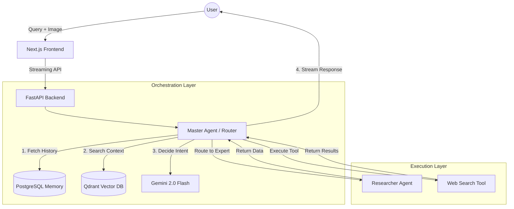

# Skilled Agent Stack

A modular, scalable, and open-source-ready AI agent stack using FastAPI, Next.js, and LiteLLM.

## 🏗 System Architecture



## Architecture Key Features
- **Router Pattern:** A central `MasterAgent` evaluates intent and delegates to specialized experts.
- **Multi-Modal:** Support for text and image-based queries out of the box.
- **LLM Agnostic:** Uses `LiteLLM` to support 100+ models (Gemini, OpenAI, Anthropic, etc.).
- **Modularity:** High-separation of concerns for sub-agents and tools.

---

## 🛠 How to Add a New Sub-Agent (e.g., Task 5)

Adding a new capability is standardized and requires 3 steps:

### 1. Create the implementation
Create a new file in `backend/app/agents/implementations/task5_agent.py`. Inherit from `BaseAgent`.

```python
from app.agents.base import BaseAgent, AgentResponse

class Task5Agent(BaseAgent):
    @property
    def name(self) -> str:
        return "task5_expert"

    @property
    def description(self) -> str:
        # This is CRITICAL. The Master Agent uses this text to route queries.
        return "Expert at [describe your new specialized task here]."

    async def process(self, query: str, history: list) -> AgentResponse:
        # Implement your logic here
        return AgentResponse(content="Success", source_agent=self.name)
```

### 2. Register the Agent
Go to `backend/app/agents/registry.py` and add your new class to the list:

```python
def get_registered_agents():
    return [
        ResearcherAgent(),
        Task5Agent(), # <--- Add this
    ]
```

### 3. Verify
Run the backend. The Master Agent will automatically "know" about the Task 5 Expert's capabilities through the updated system prompt.

---

## 🚀 Getting Started

1. **Environment:** Copy `.env.example` to `.env` and add your `GEMINI_API_KEY`.
2. **Backend:** 
   ```bash
   cd backend
   poetry install
   poetry run uvicorn app.main:app --reload
   ```
